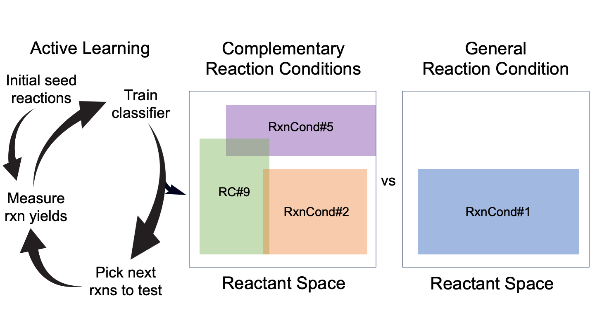

# Reaction Condition Set Optimization 

Chemical reaction conditions capable of producing high yields over diverse reactants will be a key component of future self driving labs. While much work has been done to discover general reaction conditions, any single conditions are necessarily limited over increasingly diverse chemical spaces. A potential solution to this problem is to identify small sets of complementary reaction conditions that, when combined, cover a much larger chemical space than any one general reaction condition. In this work, we analyze experimentally derived datasets to assess the relative performance of individual general reaction conditions vs. sets of complementary reaction conditions. We then propose and benchmark active learning methods to efficiently discover these complimentary sets of conditions. The results show the value of active learning in exploring sets of reaction conditions and provide an avenue for improving synthetic hit rates in high-throughput synthesis campaigns.



Different aquisition functions tested can be found in [learners](./learners) and datasets used are located in [datasets](./datasets).

## Table of Contents

- [Installation](#installation)
- [Usage](#usage)

## Installation

clone this repo, then install the pip requirements. This project was created with python 3.12

```sh
pip install -r requirements.txt
```

## Usage

The following code runs n_repeats optimization runs on the Pd-Aryl dataset, using the summation Exploit function and saves the results in a subdirectory of metrics/aryl_scope.

```python
from chemical_space import ChemicalSpace
from controller import Controller, EXPT_FAST_SUM, RF

# number of experiments suggested and run before the model is re-trained
batch_size = 20
# number of full optimization runs to be conducted
n_repeats = 50

aryl_scope = ChemicalSpace(['ligand_name'], ['electrophile_id', 'nucleophile_id'], 'datasets/real_datasets/aryl-scope-ligand.csv')
optimizer = Controller(aryl_scope, 21.66, batch_size=batch_size, max_experiments=1000, max_set_size=3, learner_type=EXPT_FAST_SUM, model_type=RF)
optimizer.do_repeats(n_repeats)
```

On a SLURM cluster, [hydra_optimize.py](hydra_optimize.py) can be used to run multiple combinations of parameters.